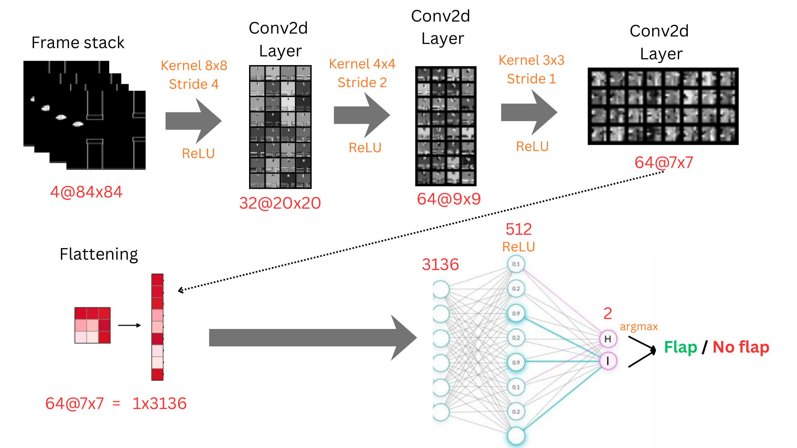
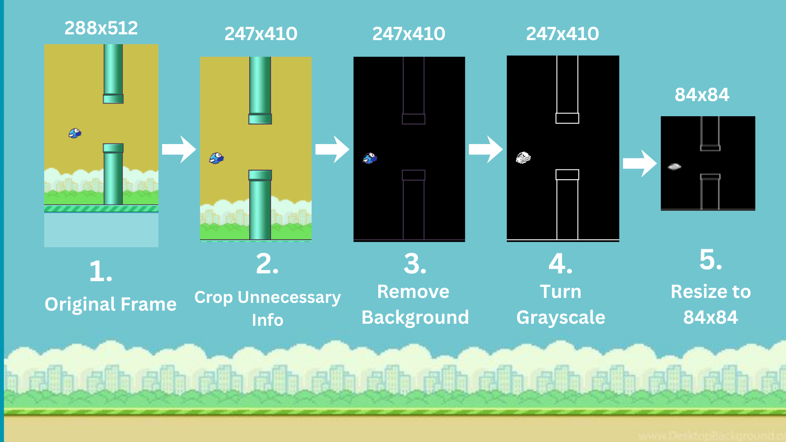

# Flappy Bird D3QN Agent

This repository contains a PyTorch implementation of a **Dueling Double Deep Q-Network (D3QN)** trained to play Flappy Bird from raw pixel inputs. The agent learns entirely from scratch by observing the game screen and receiving rewards based on its survival and score.

## Features

* **Pixel-Level Learning:** The agent processes raw RGB frames from the environment, learning spatial and temporal awareness without explicit coordinate data.
* **Double Deep Q-Network (DDQN):** Decouples action selection from action evaluation to prevent the overestimation of Q-values common in standard DQN.
* **Dueling Architecture:** Splits the network's output into two separate streams—Value $V(s)$ and Advantage $A(s, a)$—allowing the agent to learn which states are valuable independently of the actions taken.
* **Frame Stacking & Skipping:** Stacks 4 consecutive frames to give the agent a sense of velocity and momentum, while skipping every 2 frames to accelerate training.
* **Experience Replay:** Uses a replay buffer of 400,000 transitions to break temporal correlations and stabilize training.

## Neural Network Architecture



While the reference image above shows a standard DQN, this codebase implements a **Dueling DQN**. The convolutional base matches the image perfectly, but the fully connected layers are split into two streams.

### 1. Convolutional Base (Feature Extraction)
* **Input:** 4 stacked frames of size 84x84 `(4, 84, 84)`
* **Conv2d Layer 1:** 32 filters, 8x8 kernel, stride 4 -> Output: `32@20x20` (ReLU)
* **Conv2d Layer 2:** 64 filters, 4x4 kernel, stride 2 -> Output: `64@9x9` (ReLU)
* **Conv2d Layer 3:** 64 filters, 3x3 kernel, stride 1 -> Output: `64@7x7` (ReLU)
* **Flatten:** Flattens the output to a 1D tensor of `3136` elements.

### 2. Dueling Streams
Instead of connecting straight to the output actions, the 3136-element vector is passed into two separate Dense (Linear) networks:
* **Value Stream:** `Linear(3136, 512)` -> ReLU -> `Linear(512, 1)`
    * *Estimates the baseline value of being in a specific state.*
* **Advantage Stream:** `Linear(3136, 512)` -> ReLU -> `Linear(512, 2)`
    * *Estimates the relative advantage of taking a specific action (Flap or No Flap).*

The final Q-values are aggregated using the following formula to ensure identifiability:

$$Q(s, a) = V(s) + \left( A(s, a) - \frac{1}{|\mathcal{A}|}\sum_{a'} A(s, a') \right)$$

## Observation Preprocessing



The agent does not learn from the raw 288x512 color images. To optimize training speed and memory usage, the `EnvProcessor` wrapper applies the following transformations:

1.  **Grayscale Conversion:** The RGB channels are collapsed into a single channel. *(Note: Unlike the reference image, this code does not manually crop or strip the background, allowing the CNN to learn to ignore the background on its own).*
2.  **Resizing:** The frame is downsampled to an `84x84` grid using area interpolation.
3.  **Frame Skipping:** The environment advances by 2 frames per action, reducing redundant calculations.
4.  **Frame Stacking:** The last 4 processed frames are stacked together along the channel dimension, creating the `(4, 84, 84)` input tensor.
5.  **Normalization:** Pixel values are scaled from `[0, 255]` to `[0.0, 1.0]` right before being fed into the neural network.

## Hyperparameters

| Parameter | Value | Description |
| :--- | :--- | :--- |
| **Batch Size** | 64 | Number of experiences sampled from memory per learning step. |
| **Gamma** | 0.99 | Discount factor for future rewards. |
| **Epsilon Start** | 1.0 | Initial exploration rate (100% random actions). |
| **Epsilon Min** | 0.05 | Minimum exploration rate. |
| **Epsilon Decay** | 0.99997 | Multiplier applied to epsilon after every step. |
| **Learning Rate** | 1e-4 | Optimizer (Adam) step size. |
| **Target Update Freq** | 6000 | Steps between copying the Policy network to the Target network. |
| **Replay Memory** | 400,000 | Maximum capacity of the Experience Replay buffer. |
| **Start Training Step** | 3,000 | Random steps taken to populate the buffer before training begins. |

## Usage

### Prerequisites
Ensure you have the required libraries installed:
```bash
pip install torch torchvision torchaudio
pip install gymnasium opencv-python matplotlib
pip install flappy-bird-gymnasium
